<div align="center">

# 🗺️ OSINT Tracker / Impact Atlas

**AI-Powered Military Intelligence Platform**  
*Monitoring the Russia-Ukraine Conflict via Multi-Agent Swarms*

[](https://github.com/Osint-tracker/impact-atlas)
[](https://python.org)
[](LICENSE)

[Features](#-key-features) • [Tech Stack](#-tech-stack) • [Installation](#-quick-start) • [Documentation](#-documentation)

</div>

---

Impact Atlas transforms unstructured OSINT data (Telegram, GDELT, news) into actionable intelligence through a **7-agent AI pipeline**, displaying events on an interactive tactical map with real-time analysis.

## 🧠 The "Super Squad" Pipeline

```mermaid
graph LR
    Input[Raw OSINT] --> Bouncer[👮 Bouncer]
    Bouncer -->|Filtered| Brain[🧠 Brain]
    Brain --> Soldier[🪖 Soldier]
    Soldier --> Titan[🤖 Titan]
    Titan --> Calculator[Hz Calculator]
    Calculator --> Journalist[📰 Journalist]
    Journalist --> Strategist[♟️ Strategist]
    Strategist --> Output[Intelligence Feed]
    
    style Input fill:#f9f,stroke:#333
    style Output fill:#bbf,stroke:#333
    style Bouncer fill:#e1f5fe
    style Brain fill:#e1f5fe
    style Soldier fill:#e1f5fe
    style Titan fill:#e1f5fe
    style Calculator fill:#e1f5fe
    style Journalist fill:#e1f5fe
    style Strategist fill:#e1f5fe
```



---

## ✨ Key Features

| Feature | Description |
|:---|:---|
| **🤖 7-Agent Pipeline** | Sequential chain with **Self-Correction** and **Hallucination Checks**. |
| **🦅 Project Owl Integration** | **[NEW]** Live frontline data & unit tracking via Owl Maps API. |
| **🗂️ Unified Dossier** | **[NEW]** Integrated card combining ORBAT data, live position, and engagements. |
| **🎯 T.I.E. Scoring** | Unique **Target-Kinetic-Effect** vectors (1-10) for event intensity calibration. |
| **🔍 Smart Fusion** | Entity resolution & deduplication using **Vector Embeddings**. |
| **📍 ORBAT Tracker** | Real-time military unit tracking (UA/RU) with **Whitelist Filtering**. |
| **🌍 Sanity Loops** | **GeoProbe** (Coordinate Validation) & **HistoryProbe** (Kinetic Plausibility). |

---

## 🛠️ Tech Stack

<div align="center">

| Layer | Technologies |
|:---|:---|
| **Core AI** | **DeepSeek V3** • **GPT-4o-mini (Fine-Tuned)** • **Qwen 2.5** |
| **Backend** | **Python 3.12+** • **SQLite (WAL Mode)** |
| **Frontend** | **Vanilla JS** • **Leaflet.js** • **Glassmorphism UI** |
| **Data** | **Owl Harvester** • **Telethon** • **GDELT** |

</div>

---

## 🚀 Quick Start

### Prerequisites
- Python 3.12+
- API Keys: OpenAI, OpenRouter, Serper (optional)

### Installation
```bash
# Clone repository
git clone https://github.com/Osint-tracker/impact-atlas.git
cd osint-tracker

# Create virtual environment
python -m venv .venv
.venv\Scripts\activate  # Windows
source .venv/bin/activate  # Linux/Mac

# Install dependencies
pip install -r requirements.txt

# Configure environment
cp .env.example .env
# Edit .env with your API keys
```

### Run Operations
```bash
# 1. Ingest Data (Owl Maps + Telegram)
python scripts/ingest_owl_total.py  # Map Layers
python scripts/ingest_owl_db.py     # Unit Registry
python scripts/run_daily.py         # News Feed

# 2. Activate AI Pipeline
python scripts/ai_agent.py

# 3. Export to Tactical Map
python scripts/generate_output.py
```

---

## 📂 Project Structure

```
osint-tracker/
├── assets/
│   ├── data/           # GeoJSON (owl_layer.geojson), JSON exports
│   └── js/             # Frontend logic (map.js, charts.js)
├── scripts/            # Core Ecosystem
│   ├── ai_agent.py     # Main 7-Agent Pipeline
│   ├── ingest_owl_*.py # Owl Data Harvesters
│   ├── smart_fusion.py # Entity Resolution Engine
│   └── instruments/    # GeoProbe, HistoryProbe
├── index.html          # Main Dashboard UI
└── technical-spec_v1.3.md  # Full Technical Documentation
```

---

## 🧪 T.I.E. Score System

Events are scored on three **1-10 vectors**:

> **K (Kinetic)**: Weapon magnitude _(1=Rifle → 10=WMD)_  
> **T (Target)**: Target value _(1=Field → 10=Capital)_  
> **E (Effect)**: Damage outcome _(1=Miss → 10=Total Erase)_  

$$ TIE = \frac{K \times T \times E}{10} $$

---

## 📖 Documentation

- **[Technical Specification (v4.1)](technical-spec_v1.3.md)** – Architecture & Schemas
- **[GeoJSON Structure](GEOJSON_STRUCTURE.md)** – Data Format

<div align="center">
  <sub>Maintained by Osint tracker | Private Repository</sub>
</div>