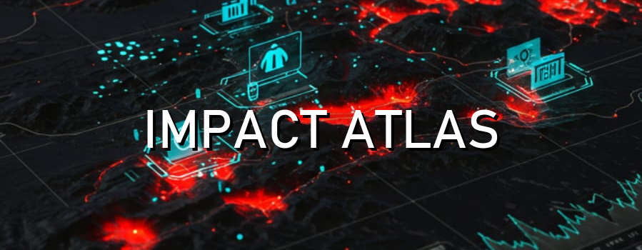

<div align="center">

<div align="center">



### **AI-POWERED MILITARY INTELLIGENCE PLATFORM**
*Autonomous Multi-Agent Swarm for Conflict Monitoring & Analysis*

[](https://github.com/Osint-tracker/impact-atlas)
[](https://github.com/Osint-tracker/impact-atlas)
[](https://python.org)
[](LICENSE)

[**MISSION BRIEF**](#-mission-brief) • [**CAPABILITIES**](#-capabilities) • [**DEPLOYMENT**](#-deployment) • [**CLASSIFIED DOCS**](#-classified-docs)

</div>

---

## 📜 Mission Brief

> **"Turning Noise into Signal."**

**IMPACT ATLAS** is a sovereign intelligence platform designed to ingest high-volume, unstructured OSINT data (Telegram, GDELT, Satellites) and distill it into precise, actionable military insights. 

Operated by a **7-Agent AI Swarm**, the system autonomously verifies targets, calculates kinetic impact, tracks unit movements, and maintains a real-time Common Operational Picture (COP) of the Russia-Ukraine theater.

---

## 🧠 The "Super Squad" Architecture


```mermaid
graph LR
    Input[📡 Raw SIGINT/OSINT] --> Bouncer[👮 Bouncer]
    Bouncer -->|Cleaned| Brain[🧠 Brain]
    Brain --> Soldier[🪖 Soldier]
    Soldier --> Titan[🤖 Titan]
    Titan --> Calculator[Hz Calculator]
    Calculator --> Journalist[📰 Journalist]
    Journalist --> Strategist[♟️ Strategist]
    Strategist --> Output[🎯 Intelligence Feed]
    
    style Input fill:#f9f,stroke:#333
    style Output fill:#0ea5e9,stroke:#333,color:#fff
    style Bouncer fill:#1e293b,stroke:#333,color:#fff
    style Brain fill:#1e293b,stroke:#333,color:#fff
    style Soldier fill:#1e293b,stroke:#333,color:#fff
    style Titan fill:#b91c1c,stroke:#333,color:#fff
    style Calculator fill:#1e293b,stroke:#333,color:#fff
    style Journalist fill:#1e293b,stroke:#333,color:#fff
    style Strategist fill:#1e293b,stroke:#333,color:#fff
```

---

## 🛠️ Capabilities

### ⚡ Kinetic Analysis
| Vector | Description | Status |
|:---|:---|:---|
| **Targeting** | Automatic identification of HVT (High Value Targets) vs. Civilian objects. | ✅ Active |
| **Ballistics** | Weapon system identification (S-300, Himars, Shahed) via text signatures. | ✅ Active |
| **Damage** | **T.I.E. Scoring** (Target-Kinetic-Effect) to assess strike effectiveness (1-100). | ✅ Active |
| **Reliability & Bias** | Source grading (0-100 scale) and political bias detection. | ✅ Active |

### 🌐 Data Ingestion & Sources
| Source | Type | Status |
|:---|:---|:---|
| **Telegram / Web** | Near real-time text/media via custom API connectors. | ✅ Active |
| **GDELT Project** | Global event database ingestion for macro-trends. | ✅ Active |
| **NASA FIRMS** | Thermal hotspots (VIIRS/MODIS) bounded to UA/RU conflict zone. | ✅ Active |
| **Open-Meteo V.F.R** | Live Drone Visibility Index (cloud cover & visibility) for 5 frontline sectors. | ✅ Active |
| **Parabellum & WarSpotting** | Specialized military databases for unit and equipment tracking. | ✅ Active |

### 🗺️ Geospatial Intelligence & C4ISR Dashboard (V2)
| Component | Description | Status |
|:---|:---|:---|
| **Project Owl** | Live frontline integration & unit tracking (International/OSINT). | ✅ Active |
| **ORBAT Tracker** | Regimental/Brigade level unit tracking with **Whitelist Filtering** & Factions (UA/RU). | ✅ Active |
| **C4ISR Nav Rail** | Advanced UI with Analytics Drawer, Tactical Graveyard (Equipment Losses), and Operational Tempo. | ✅ Active |
| **Semantic Clustering** | AI clustering of related events into Deep Strike Dossiers with tactical kill-chain visuals. | ✅ Active |
| **Intelligence Briefing** | Automated generation of daily NATO-grade HTML Intelligence Reports. | ✅ Active |

---

## 🚀 Deployment

### Prerequisites
- **Python 3.12+**
- **API Access**: OpenRouter (DeepSeek V3.2/Qwen), OpenAI (GPT-4o), Photon Geocoder

### Protocol: Initiation
```bash
# 1. Clone Repository
git clone https://github.com/Osint-tracker/impact-atlas.git
cd osint-tracker

# 2. Establish Environment
python -m venv .venv
source .venv/bin/activate

# 3. Install Dependencies
pip install -r requirements.txt

# 4. Configure Credentials
cp .env.example .env
```

### Protocol: Operation
```bash
# [PHASE 1] Data Ingestion
python scripts2/master_ingestor.py      # Main pipeline (Telegram, GDELT, Parbaellum, etc.)
python map_loader.py                    # FIRMS & OSINT map layers

# [PHASE 2] AI Analysis (Swarm Activation)
python scripts2/ai_agent.py

# [PHASE 3] Geocoding & Refinement
python scripts2/geolocator_agent.py

# [PHASE 4] Tactical Display
python scripts2/generate_output.py
# -> Open index.html
```

---

## 📂 System Hierarchy

```
osint-tracker/
├── assets/                 # Frontend Assets
│   ├── data/               # GeoJSON, JSON exports (events, ORBAT, FIRMS)
│   ├── js/                 # Tactical Display Logic (map.js, orbat_tracker.js)
│   └── css/                # V2 Styling (index.css, report_styles.css)
├── scripts2/               # Command & Control Python backend
│   ├── master_ingestor.py  # Data acquisition
│   ├── ai_agent.py         # DeepSeek Swarm Orchestrator
│   ├── geolocator_agent.py # Photon/AI geocoding
│   └── generate_output.py  # GeoJSON compiler
├── map_loader.py           # FIRMS & OSINT data fetcher
├── index.html              # V2 C4ISR Dashboard Interface
├── report.html             # NATO-grade Daily Briefing
└── technical-specification.md  # Master Specs
```

---

## 🧪 Score Vector (T.I.E.)

$$ TIE = \frac{K \times T \times E}{10} $$

> **K (Kinetic)**: Weapon magnitude _(1=Rifle → 10=WMD)_  
> **T (Target)**: Target value _(1=Field → 10=Capital)_  
> **E (Effect)**: Damage outcome _(1=Miss → 10=Total Erase)_  

---

## 📚 Classified Docs

- **[Technical Specification (v4.1)](technical-specification.md)** – Full Architecture
- **[Data Schema](GEOJSON_STRUCTURE.md)** – JSON Formats

<div align="center">
  <sub>Authorized Personnel Only | Private Repository</sub>
</div>