<div align="center">

<div align="center">


### **AI-POWERED MILITARY INTELLIGENCE PLATFORM**
*Autonomous Multi-Agent Swarm for Conflict Monitoring & Analysis*

[](https://github.com/Osint-tracker/impact-atlas)
[](https://github.com/Osint-tracker/impact-atlas)
[](https://python.org)
[](LICENSE)

[**MISSION BRIEF**](#-mission-brief) • [**CAPABILITIES**](#-capabilities) • [**DEPLOYMENT**](#-deployment) • [**CLASSIFIED DOCS**](#-classified-docs)

</div>

---

## 📜 Mission Brief

> **"Turning Noise into Signal."**

**IMPACT ATLAS** is a sovereign intelligence platform designed to ingest high-volume, unstructured OSINT data (Telegram, GDELT, Satellites) and distill it into precise, actionable military insights. 

Operated by a **7-Agent AI Swarm**, the system autonomously verifies targets, calculates kinetic impact, tracks unit movements, and maintains a real-time Common Operational Picture (COP) of the Russia-Ukraine theater.

---

## 🧠 The "Super Squad" Architecture

```mermaid
graph LR
    Input[📡 Raw SIGINT/OSINT] --> Bouncer[👮 Bouncer]
    Bouncer -->|Cleaned| Brain[🧠 Brain]
    Brain --> Soldier[🪖 Soldier]
    Soldier --> Titan[🤖 Titan]
    Titan --> Calculator[Hz Calculator]
    Calculator --> Journalist[📰 Journalist]
    Journalist --> Strategist[♟️ Strategist]
    Strategist --> Output[🎯 Intelligence Feed]
    
    style Input fill:#f9f,stroke:#333
    style Output fill:#0ea5e9,stroke:#333,color:#fff
    style Bouncer fill:#1e293b,stroke:#333,color:#fff
    style Brain fill:#1e293b,stroke:#333,color:#fff
    style Soldier fill:#1e293b,stroke:#333,color:#fff
    style Titan fill:#b91c1c,stroke:#333,color:#fff
    style Calculator fill:#1e293b,stroke:#333,color:#fff
    style Journalist fill:#1e293b,stroke:#333,color:#fff
    style Strategist fill:#1e293b,stroke:#333,color:#fff
```



---

## 🛠️ Capabilities

### ⚡ Kinetic Analysis
| Vector | Description | Status |
|:---|:---|:---|
| **Targeting** | Automatic identification of HVT (High Value Targets) vs. Civilian objects. | ✅ Active |
| **Ballistics** | Weapon system identification (S-300, Himars, Shahed) via text signatures. | ✅ Active |
| **Damage** | **T.I.E. Scoring** (Target-Kinetic-Effect) to assess strike effectiveness (1-10). | ✅ Active |

### 🗺️ Geospatial Intelligence
| Component | Description | Status |
|:---|:---|:---|
| **Project Owl** | Live frontline integration & unit tracking (International/OSINT). | ✅ Active |
| **ORBAT Tracker** | Regimental/Brigade level unit tracking with **Whitelist Filtering**. | ✅ Active |
| **GeoProbe** | Self-healing coordinate validation loop to prevent mapping errors. | ✅ Active |

---

## 🚀 Deployment

### Prerequisites
- **Python 3.12+**
- **API Access**: OpenRouter (DeepSeek/Qwen), OpenAI (GPT-4o)

### Protocol: Initiation
```bash
# 1. Clone Repository
git clone https://github.com/Osint-tracker/impact-atlas.git
cd osint-tracker

# 2. Establish Environment
python -m venv .venv
source .venv/bin/activate

# 3. Install Dependencies
pip install -r requirements.txt

# 4. Configure Credentials
cp .env.example .env
```

### Protocol: Operation
```bash
# [PHASE 1] Data Ingestion (Owl + Telegram)
python scripts/ingest_owl_total.py  # Map Layers
python scripts/ingest_owl_db.py     # Unit Registry
python scripts/run_daily.py         # News Feed

# [PHASE 2] AI Analysis (Swarm Activation)
python scripts/ai_agent.py

# [PHASE 3] Tactical Display
python scripts/generate_output.py
# -> Open index.html
```

---

## 📂 System Hierarchy

```
osint-tracker/
├── assets/             # Intelligence Assets
│   ├── data/           # GeoJSON, JSON exports
│   └── js/             # Tactical Display Logic
├── scripts/            # Command & Control
│   ├── ai_agent.py     # Swarm Orchestrator
│   ├── ingest_owl_*.py # External Feeds
│   └── instruments/    # Probes (Geo/History)
├── index.html          # Dashboard Interface
└── technical-spec_v1.3.md  # Classified Specs
```

---

## 🧪 Score Vector (T.I.E.)

$$ TIE = \frac{K \times T \times E}{10} $$

> **K (Kinetic)**: Weapon magnitude _(1=Rifle → 10=WMD)_  
> **T (Target)**: Target value _(1=Field → 10=Capital)_  
> **E (Effect)**: Damage outcome _(1=Miss → 10=Total Erase)_  

---

## 📚 Classified Docs

- **[Technical Specification (v4.1)](technical-spec_v1.3.md)** – Full Architecture
- **[Data Schema](GEOJSON_STRUCTURE.md)** – JSON Formats

<div align="center">
  <sub>Authorized Personnel Only | Private Repository</sub>
</div>