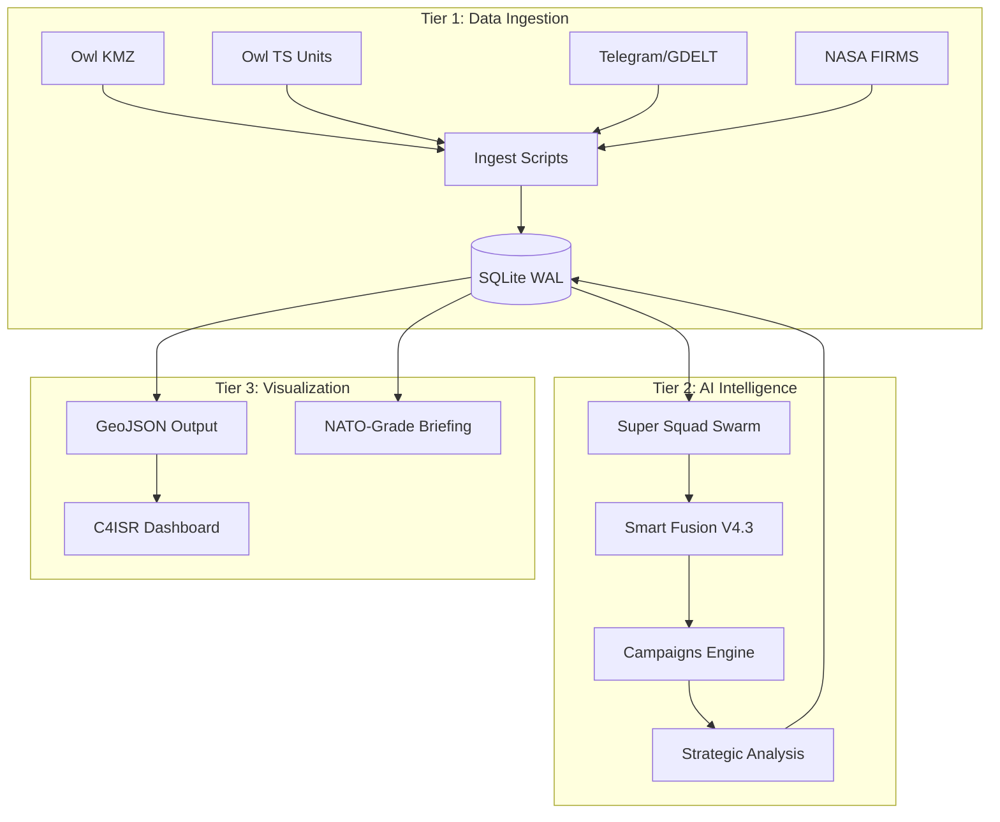
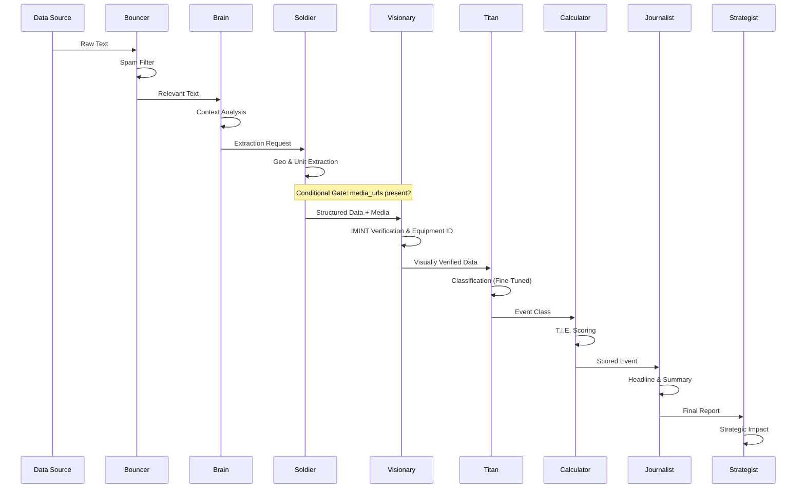

# MASTER TECHNICAL SPECIFICATION DOCUMENT (TSD)

**Project:** OSINT Military Intelligence Tracker & Analysis Platform  
**Version:** 6.0.0 (Neural Fusion V2)  
**Date:** May 09, 2026  
**Status:** Operational / Field-Proven  
**Maintainer:** Senior AI Architect & Technical Product Manager

---

## 📜 Table of Contents

1. [Metadata](#metadata)
2. [Rule Priority Order](#rule_priority_order)
3. [Goals & Non-Goals](#goals)
4. [Architecture](#architecture)
   - [Tier Structure](#tier_structure)
   - [Technology Stack](#technology_stack)
5. [Components](#components)
   - [Super Squad AI Pipeline](#component_1_super_squad_ai_pipeline)
   - [Smart Fusion Engine](#component_2_smart_fusion_engine)
   - [AI Classification Model (MIA)](#component_3_ai_classification_model_mia)
   - [Project Owl Integration](#component_4_project_owl_integration)
6. [Data Schemas](#data_schemas)
7. [Validation Rules](#validation_rules)
8. [Deployment](#deployment)

---

## METADATA
```yaml
document_type: technical_specification
semantic_version: 5.0.0
status: OPERATIONAL
last_updated: 2026-05-02
scope: complete_system
components:
  - AI_Military_Intelligence_Analyst
  - Project_Owl_Integration
  - OSINT_Tracker_Backend
  - Impact_Atlas_Frontend
  - Campaigns_Engine_Planned
```

---

## RULE_PRIORITY_ORDER
```yaml
rule_priority_order:
  - INVARIANTS
  - HARD_CONSTRAINTS
  - VALIDATION_RULES
  - SOFT_HEURISTICS
  - DEFAULTS
```

---

## GOALS

**PRIMARY_OBJECTIVE:**  
```yaml
value: Convert high-volume, multi-lingual OSINT (Telegram, Web, GDELT) into structured, tactical military intelligence.
```

**SPECIFIC_GOALS:**
```yaml
goal_1:
  value: Classify military events according to tactical doctrine
goal_2:
  value: Distinguish military tactics - Attrition, Manoeuvre, Shaping
goal_3:
  value: Filter propaganda through algorithmic scoring
goal_4:
  value: Provide reliable Common Operational Picture (COP) for OSINT analysts
```

---

## NON_GOALS

```yaml
non_goal_1:
  value: Real-time streaming
  rationale: Deferred to Phase 3
non_goal_2:
  value: Multi-conflict support
  rationale: Deferred to Phase 3
non_goal_3:
  value: Mobile native application
  rationale: Deferred to Phase 3
non_goal_4:
  value: Traditional database backend
non_goal_5:
  value: Always-on server infrastructure
```

---

## ARCHITECTURE

### TIER_STRUCTURE



```yaml
tier_1:
  name: DATA_INGESTION_AND_PREPROCESSING
  purpose: Multi-source acquisition and normalization
  components:
    - Owl Map Harvester (KMZ -> GeoJSON)
    - Owl Unit Harvester (TypeScript -> JSON)
    - Telegram & Web API scrapers
    - NASA FIRMS Thermal Scraper
    - GDELT Event Ingestion
    - Parabellum & WarSpotting DB Connectors
    - SQLite database (WAL Mode)
  
tier_2:
  name: AI_ANALYSIS_AND_FUSION
  purpose: Event classification, IMINT verification, and deduplication
  components:
    - Super Squad AI Pipeline (7-Agent Swarm)
    - The Visionary (IMINT Verification)
    - Smart Fusion Engine (Judge-AI based)
    - Campaigns Engine (Strategic Grouping - PLANNED)
  
tier_3:
  name: VISUALIZATION_AND_REPORTING
  purpose: Command-level presentation and reporting
  components:
    - V2 C4ISR Navigation Interface
    - Leaflet.js Tactical Map
    - ORBAT Tracker & Operational Tempo
    - Intelligence Briefing Generator
```

### TECHNOLOGY_STACK
```yaml
runtime:
  value:
    language: Python
    version: ">=3.13"
  constraint: HARD_CONSTRAINT

database:
  value:
    engine: SQLite
    mode: WAL
  rationale: High-concurrency writes
  constraint: HARD_CONSTRAINT

llm_inference:
  value:
    providers:
      - OpenRouter (Primary)
      - OpenAI (Legacy/Backfill)
    models:
      orchestration: DeepSeek V4 Flash
      extraction: Qwen 3.5 Flash
      vision: qwen/qwen3-vl-235b-a22b-instruct
      audio_stt: openai/whisper-large-v3-turbo
      embedding: openai/text-embedding-3-large (1536-dim)
  constraint: HARD_CONSTRAINT

fine_tuning:
  value:
    method: QLoRA
    base_model: GPT-4o-mini
    version: Titan v5
  constraint: HARD_CONSTRAINT

frontend:
  value:
    technologies: [HTML5, Vanilla JS, Leaflet.js]
    framework: NONE
  constraint: HARD_CONSTRAINT

hosting:
  value:
    platform: GitHub Pages
    cost: Zero
    deployment_model: GitOps
  constraint: HARD_CONSTRAINT

ci_cd:
  value:
    platform: GitHub Actions
    schedule: Cron-based ETL jobs
  constraint: HARD_CONSTRAINT
```

---

## COMPONENTS

### COMPONENT_1: SUPER_SQUAD_AI_PIPELINE

**PURPOSE:**  
```yaml
value: Sequential multi-agent chain for intelligent event processing
```

**AGENT FLOW:**


**AGENT_CONFIGURATION:**
```yaml
agent_1:
  name: The Bouncer
  role: Security and Spam Filter
  purpose: Discards crypto spam, non-military news, and malformed inputs.
  model: Qwen 3.5 Flash
  temperature: 0.0
  output_format: Boolean + Reason

agent_2:
  name: The Brain
  role: Strategic Coordinator
  purpose: Analyzes general context and orchestrates decision flow.
  model: DeepSeek V4 Flash
  temperature: 0.0
  output_format: Structured Decision JSON

agent_3:
  name: The Soldier
  role: Tactical Data Extraction
  purpose: Extracts coordinates, timestamps, units, and weaponry using TITAN-10 protocol.
  model: Qwen 3.5 Flash
  temperature: 0.0
  output_format: Strict JSON
  failure_mode: ABORT_IF_NO_VALID_DATE

agent_3.5:
  name: The Visionary 2.0
  role: Multimodal IMINT/SIGINT Hybrid
  purpose: Neural fusion of visual (Video/Image) and auditory (Whisper STT) evidence. Cross-references extraction against pixel/sound ground truth.
  model: qwen/qwen3-vl-235b-a22b-instruct
  sampling_logic: Geometric Sampling (4 frames at 10%, 40%, 70%, 90%)
  audio_integration: Whisper STT (openai/whisper-large-v3-turbo)
  temperature: 0.0
  activation_trigger: Conditional — media_urls present
  pipeline_position: After The Soldier, Before The Titan

agent_4:
  name: The Titan
  role: Fine-Tuned Classification
  purpose: Specialized classification (Attrition, Manoeuvre, Shaping) via Titan v5 model.
  model: Titan v5 (FT GPT-4o-mini)
  temperature: 0.0
  output_format: JSON Classification

agent_5:
  name: The Calculator
  role: Scoring Engine
  purpose: Calculates Reliability, Bias, and TITAN-10 scores.
  model: Python Deterministic (TitanSensor)
  provider: INTERNAL
  output_format: JSON Numbers

agent_6:
  name: The Journalist
  role: Content Synthesis
  purpose: Generates headlines and bilingual summaries (IT/EN) in a neutral style.
  model: GPT-4o-mini
  temperature: 0.0
  output_format: JSON Text Fields

agent_7:
  name: The Strategist
  role: Tactical Insight
  purpose: High-level analysis of strategic implications and campaign impact.
  model: DeepSeek V4 Flash
  temperature: 0.1
  output_format: Analytical Text
```

**IMPLEMENTATION_RULES:**
```yaml
rule_1:
  value: All class methods must use self reference
  example: "def perform_search(self, query):"
  constraint: HARD_CONSTRAINT
  
rule_2:
  value: Robust JSON parsing with retry logic
  max_attempts: 3
  fallback: Regex extraction
  constraint: HARD_CONSTRAINT
  
rule_3:
  value: Safety stop on date extraction failure
  abort_condition: "The Soldier fails to extract valid date"
  rationale: Prevent database contamination
  constraint: HARD_CONSTRAINT
  
rule_4:
  value: Comprehensive logging per agent
  required_fields:
    - timestamp
    - model_used
    - tokens_consumed
  constraint: HARD_CONSTRAINT
```

---

### COMPONENT_2: SMART_FUSION_ENGINE

**PURPOSE:**  
```yaml
value: Exception handling, secondary deduplication, and garbage collection
```

**STATUS:**
```yaml
role: Secondary Layer (Legacy Engine)
relegated_by: Greedy Vector Matcher (Event Builder V2)
```

**CORE_QUESTION:**  
```yaml
value: "Do these two news items refer to the same physical event?"
```

**FUNNEL_LOGIC:**
```yaml
stage_1_propaganda_gate:
  name: pHash Anti-Recycling
  value:
    similarity_threshold: 95%
    lookback: 60 days
    action: Tag as NULL if recycled asset detected
  constraint: HARD_CONSTRAINT

stage_2_temporal_filter:
  name: Temporal Delta Check
  value:
    threshold: 48 hours
  constraint: HARD_CONSTRAINT

stage_3_vector_filter:
  name: Semantic Similarity (Primary)
  value:
    logic: Greedy Vector Matcher (within event_builder.py)
    model: openai/text-embedding-3-large
    dimensions: 1536
    threshold: 0.85
    temporal_window: 48 hours
  constraint: HARD_CONSTRAINT

stage_4_geo_spatial_filter:
  name: Dynamic Geographic Distance
  value:
    standard_threshold: 150 km
    fast_track_threshold: 10 km (Auto-merge if Sim >= 0.85)
  constraint: HARD_CONSTRAINT

stage_5_llm_validation:
  name: The Judge
  value:
    model: MiniMax M2.5
    prompt_type: Entity Resolution Task
    output_format: JSON Boolean
  constraint: HARD_CONSTRAINT
```

**MERGE_PROTOCOL:**
```yaml
incremental_mode:
  value: Uses fusion_checked_at timestamp to avoid redundant scans
  constraint: HARD_CONSTRAINT

fast_track_rules:
  rule_1: "Sim >= 0.85 + Dist <= 10km + Time <= 12h -> AUTO_MERGE"
  rule_2: "Sim >= 0.95 (No Geo) -> AUTO_MERGE"

source_reputation:
  value: Dynamic scoring (0-100) per domain
  penalty: -10 points for detected propaganda (pHash hit)
```

**MERGE_PROTOCOL:**
```yaml
master_event:
  value:
    selection_rule: Chronologically oldest event
    status_transition: PENDING
    data_action: Enriched with child data, returned to pipeline

child_events:
  value:
    status_transition: MERGED
    data_action: Soft delete, preserved for audit
  
data_aggregation:
  value:
    text_handling: Concatenated
    source_handling: Aggregated with URL deduplication
    embedding_handling: Recalculated
```

**CRITICAL_BUG_FIX:**
```yaml
issue: Ghost Cluster Loop Prevention
value: Before saving cluster, verify at least one event has status != MERGED
action_if_all_merged: IGNORE_CLUSTER
status: RESOLVED
constraint: HARD_CONSTRAINT
```

---

### COMPONENT_3: AI_CLASSIFICATION_MODEL (MIA)

**MODEL_SPECIFICATIONS:**
```yaml
base_model:
  value: Gpt 4o-mini
  alternative: Successor SOTA as of January 2026
  rationale: Balance between reasoning capability and inference speed on consumer hardware
  constraint: HARD_CONSTRAINT

context_window:
  value:
    minimum: 8k tokens
  rationale: OSINT messages brief but reasoning output-heavy
  constraint: HARD_CONSTRAINT
```

**FINE_TUNING_STRATEGY:**
```yaml
technique:
  value: QLoRA
  full_name: Quantized Low-Rank Adaptation

target_modules:
  value:
    - q_proj
    - k_proj
    - v_proj
    - o_proj
    - gate_proj
    - up_proj
    - down_proj
  rationale: All linear layers

precision:
  value:
    training: FP16/BF16
    base_model: 4-bit quantization

loss_function:
  value:
    type: Cross-Entropy
    masking: Calculate loss only on assistant responses, not user prompts
  constraint: HARD_CONSTRAINT
```

**HYPERPARAMETERS:**
```yaml
epochs:
  value: 3
  rationale: Avoid overfitting on dense dataset
  type: DEFAULT

learning_rate:
  value: 2e-4
  rationale: Standard for QLoRA
  type: DEFAULT

batch_size:
  value: [4, 8]
  additional: With Gradient Accumulation
  type: DEFAULT

lora_rank:
  value: 64
  rationale: Balance capacity/efficiency
  type: DEFAULT

lora_alpha:
  value: 128
  rationale: Standard 2x rank
  type: DEFAULT
```

**TRAINING_DATA_FORMAT:**
```json
{
  "messages": [
    {
      "role": "system",
      "content": "You are a military intelligence analyst. Analyze the input based on kinetic impact, target type, and strategic intent. Output ONLY valid JSON. Use Chain-of-Thought reasoning before classification."
    },
    {
      "role": "user",
      "content": "[RAW OSINT TEXT]"
    },
    {
      "role": "assistant",
      "content": "{\"classification\": \"SHAPING_OFFENSIVE\", \"target_type\": \"ammunition_depot\", \"reasoning\": \"Target: Ammo depot identified via satellite imagery. Action: Precision strike with HIMARS (6 hits reported). Rule: Attacking enemy logistics to degrade offensive capability = Shaping Operation per JP 3-0.\", \"confidence\": 0.92}"
    }
  ]
}
```

**TAXONOMY:**
```yaml
ATTRITION:
  value:
    definition: Routine firefights without territorial/strategic gain. Generic targets (trenches, isolated vehicles).
    key_indicators:
      - contact
      - skirmish
      - firefight
      - no breakthrough
  constraint: HARD_CONSTRAINT

SHAPING_OFFENSIVE:
  value:
    definition: Attacks on logistics/offensive infrastructure (bridges, ammunition depots, command centers) to prepare maneuvers.
    key_indicators:
      - depot
      - bridge
      - command post
      - ammunition
  constraint: HARD_CONSTRAINT

SHAPING_COERCIVE:
  value:
    definition: Attacks on civilian infrastructure (energy grid, water, population) for psychological pressure.
    key_indicators:
      - power plant
      - civilian
      - water supply
  constraint: HARD_CONSTRAINT

MANOEUVRE:
  value:
    definition: Troop movements, territorial gains, encirclements. Focus on space and position.
    key_indicators:
      - advance
      - retreat
      - encirclement
      - liberated
  constraint: HARD_CONSTRAINT

INCOHERENT_DISARRAY:
  value:
    definition: Operational failures - friendly fire, mutinies, panic, unplanned losses.
    key_indicators:
      - friendly fire
      - mutiny
      - chaotic
      - unplanned
  constraint: HARD_CONSTRAINT

LOGISTICS:
  value:
    definition: Support operations - resupply, evacuations, fortification construction.
    key_indicators:
      - supply convoy
      - evacuation
      - resupply
  constraint: HARD_CONSTRAINT

NULL:
  value:
    definition: Propaganda, politics, history, personal opinions, context-free links, sarcasm.
    key_indicators:
      - political discourse
      - historical references
      - memes
  constraint: HARD_CONSTRAINT
```

**DATA_AUGMENTATION_STRATEGY:**
```yaml
group_a:
  name: Legacy
  value:
    size: 673 rows
    quality: Correct format but reasoning too synthetic
    action: Re-inference with Teacher model
    teacher_model: [DeepSeek R1, GPT-4o]
    prompt: Group B System Prompt to force Chain-of-Thought
  type: SOFT_HEURISTIC

group_b:
  name: Golden
  value:
    size: 500 rows
    quality: High quality, includes CoT and self-correction
    action: Conversion from proprietary format to standard messages format
  type: SOFT_HEURISTIC

target_volume:
  value: ">=1200"
  quality_requirement: Uniform CoT across all examples
  constraint: HARD_CONSTRAINT
```

---

### COMPONENT_4: PROJECT_OWL_INTEGRATION

**PURPOSE:**
```yaml
value: Ingest authoritative frontline and unit data from Project Owl
```

**PIPELINE_STAGES:**
```yaml
stage_1:
  name: Map Layer Harvester
  script: ingest_owl_total.py
  input: Remote KMZ (UAControlMapBackups/latest.kmz)
  process: 
    - Decompress KMZ
    - Parse KML (Points, LineStrings, Polygons)
    - Extract Metadata (Name, Description, StyleURL)
  output: assets/data/owl_layer.geojson
  frequency: Daily

stage_2:
  name: Unit Data Harvester
  script: ingest_owl_db.py
  input: Remote Repo ZIP (owlmaps/units)
  process:
    - Scan TypeScript definition files
    - Extract Unit Hierarchy, Social Links, Faction
    - Filter by UA/RU side
  output: assets/data/orbat_full.json
  frequency: Daily

---

### COMPONENT_13: VISION_RESCUE_ENGINE

**PURPOSE:**
```yaml
value: Neural recovery of "Media Orphans" (is_embedded = 4)
```

**PROCESS_FLOW:**
```yaml
step_1_interception:
  trigger: "is_embedded = 4 detected in raw_signals"
  description: Intercepts records with valid media URLs but zero textual intelligence.
step_2_geometric_sampling:
  logic: OpenCV/FFmpeg extraction
  percentiles: [10%, 40%, 70%, 90%]
  rationale: Capture beginning, middle, and end of tactical events.
step_3_audio_rescue:
  logic: FFmpeg stream extraction to MP3
  transcription_model: openai/whisper-large-v3-turbo
step_4_multimodal_synthesis:
  model: qwen/qwen3-vl-235b-a22b-instruct
  context_injection: "Shadow Context" (Source + Date)
  output: Technical BDA description
step_5_reintegration:
  action: "text_content updated -> embedding_vector generated -> is_embedded = 1"
```
```

---

## DATA_SCHEMAS

### SCHEMA_1: OUTPUT_JSON_SCHEMA

**PURPOSE:**  
```yaml
value: Enforce strict structure for model output
```

**JSON_SCHEMA:**
```json
{
  "type": "object",
  "properties": {
    "classification": {
      "type": "string",
      "enum": [
        "ATTRITION",
        "SHAPING_OFFENSIVE",
        "SHAPING_COERCIVE",
        "MANOEUVRE",
        "INCOHERENT_DISARRAY",
        "LOGISTICS",
        "NULL"
      ]
    },
    "target_type": {
      "type": "string",
      "description": "The physical entity targeted (e.g., 'bridge', 'ammo_depot', 'civilian_grid', 'none')."
    },
    "reasoning": {
      "type": "string",
      "description": "Chain-of-Thought: Target identified → Action detected → Doctrinal rule applied. Includes hallucination verification."
    },
    "confidence": {
      "type": "number",
      "minimum": 0,
      "maximum": 1,
      "description": "Degree of certainty based on input text clarity."
    }
  },
  "required": ["classification", "target_type", "reasoning", "confidence"]
}
```

**CONSTRAINT:**
```yaml
value: All model outputs must conform to JSON Schema
constraint: HARD_CONSTRAINT
```

---

### SCHEMA_2: DATABASE_TABLE_UNIQUE_EVENTS

**PURPOSE:**  
```yaml
value: Persistent storage for processed intelligence events
```

**TABLE_DEFINITION:**
```yaml
table_name: unique_events (war_tracker_v2/data/raw_events.db)

columns:
  event_id: { type: TEXT, constraint: PRIMARY KEY, description: SHA-256 hash }
  first_seen_date: { type: TEXT, description: Initial ingestion timestamp }
  last_seen_date: { type: TEXT, description: Last activity timestamp (ISO) }
  article_count: { type: INTEGER, description: Number of sources reporting this event }
  sources_list: { type: TEXT, description: Aggregated domain list (JSON array) }
  urls_list: { type: TEXT, description: Aggregated URL list (JSON array) }
  full_text_dossier: { type: TEXT, description: Concatenated raw content }
  ai_analysis_status: { type: TEXT, default: "'PENDING'", enum: [PENDING, COMPLETED, VERIFIED, MERGED, NULL] }
  ai_report_json: { type: TEXT, description: Serialized output from Super Squad }
  embedding_vector: { type: TEXT, description: JSON-serialized 1536-dim vector }
  tie_score: { type: FLOAT, description: Normalized TITAN-10 total score }
  kinetic_score: { type: REAL, description: TITAN-10 Vector K }
  target_score: { type: REAL, description: TITAN-10 Vector T }
  effect_score: { type: REAL, description: TITAN-10 Vector E }
  reliability: { type: INTEGER, range: [0, 100] }
  bias_score: { type: REAL, range: [-1.0, 1.0] }
  ai_summary: { type: TEXT, description: Neutral tactical summary }
  has_video: { type: INTEGER, description: Boolean flag for media presence }
  media_urls: { type: TEXT, description: JSON array of image/video URLs }
  operational_sector: { type: TEXT, description: Geographic sector ID }
  source_reputation_score: { type: REAL, description: Aggregated reputation }
  image_phash: { type: TEXT, description: Perceptual hash for image deduplication }
  lat: { type: REAL, description: Decimal latitude }
  lon: { type: REAL, description: Decimal longitude }
  fusion_checked_at: { type: TEXT, description: Last Smart Fusion run timestamp }
  campaign_id: { type: TEXT, description: Linked strategic campaign ID }
  campaign_match_meta: { type: TEXT, description: AI reasoning for campaign link }

---

### SCHEMA_3: DATABASE_TABLE_RAW_SIGNALS

**PURPOSE:**  
```yaml
value: Ingestion buffer for raw multi-source signals
```

**TABLE_DEFINITION:**
```yaml
table_name: raw_signals (war_tracker_v2/data/raw_events.db)

columns:
  event_hash: { type: TEXT, constraint: PRIMARY KEY }
  url: { type: TEXT, description: Source URL }
  media_urls: { type: TEXT, description: JSON array of media links }
  source_name: { type: TEXT, description: Domain or channel name }
  date_published: { type: TEXT, description: ISO timestamp }
  text_content: { type: TEXT, description: Raw text or Rescued tactical description }
  embedding_vector: { type: TEXT, description: 1536-dim vector (Neural Fusion V2) }
  is_embedded: 
    type: INTEGER
    enum: 
      - 0: PENDING
      - 1: COMPLETED
      - 4: MEDIA_ORPHAN (Requires Vision Rescue)
```
```

**DATABASE_CONFIGURATION:**
```yaml
mode:
  value: WAL
  full_name: Write-Ahead Logging
  rationale: High concurrency writes
  constraint: HARD_CONSTRAINT

indexes:
  index_1:
    value:
      field: date
      type: STANDARD
  index_2:
    value:
      field: ai_analysis_status
      type: STANDARD
  index_3:
    value:
      fields: [lat, lon]
      type: COMPOSITE
    rationale: Geographic queries
```

---

## VALIDATION_RULES

### VALIDATION_1: MODEL_OUTPUT_QUALITY

**METRICS:**
```yaml
json_syntax_validity:
  value:
    description: Percentage of outputs that are valid JSON
    target: ">99%"
  constraint: HARD_CONSTRAINT

classification_accuracy:
  value:
    description: Predicted class vs ground truth on test set
    test_set_size: 100 rows
    data_split: Hold-out
  constraint: HARD_CONSTRAINT

reasoning_quality:
  value:
    description: Manual sample review to verify Target → Action → Rule logic
    method: Human evaluation
  type: SOFT_HEURISTIC
```

### VALIDATION_2: ROBUSTNESS_TESTING

**EDGE_CASES:**
```yaml
ambiguous_texts:
  value:
    description: Messages with both military and political keywords
    expected_behavior: Correct disambiguation
  constraint: HARD_CONSTRAINT

mixed_language:
  value:
    description: Russian/Ukrainian transliterated terms or slang
    examples: [Katsap, Orcs]
    expected_behavior: Correct classification
  constraint: HARD_CONSTRAINT

empty_spam_inputs:
  value:
    description: Empty or pure spam content
    expected_behavior: NULL return without hallucinations
  constraint: HARD_CONSTRAINT
```

---

## DEPLOYMENT

### DEPLOYMENT_1: MODEL_INFERENCE

**ENGINE_OPTIONS:**
```yaml
option_1:
  value:
    name: vLLM
    purpose: High-throughput inference

option_2:
  value:
    name: Llama.cpp
    format: GGUF
    purpose: Edge device support
```

**SAMPLING_PARAMETERS:**
```yaml
temperature:
  value: [0.0, 0.1]
  rationale: Maximize determinism and JSON structure
  constraint: HARD_CONSTRAINT

stop_tokens:
  value: ["}"]
  rationale: Prevent generation beyond JSON
  constraint: HARD_CONSTRAINT
```

**HARDWARE_REQUIREMENTS:**
```yaml
minimum_gpu:
  value:
    vram: 12 GB
    quantization: 8-bit
  constraint: HARD_CONSTRAINT

alternative_gpu:
  value:
    vram: 8 GB
    quantization: 4-bit
  constraint: SOFT_HEURISTIC
```

---

### DEPLOYMENT_2: FRONTEND_ARCHITECTURE

**PHILOSOPHY:**
```yaml
value:
  paradigm: Serverless Static GitOps
  no_traditional_database: true
  no_always_on_backend: true
  infrastructure: GitHub ecosystem
constraint: HARD_CONSTRAINT
```

**DATA_FLOW:**
```yaml
step_1:
  value:
    source: Google Sheets (Ingestion)
  
step_2:
  value:
    process: GitHub Action (Cron ETL)
    script: ai_agent.py
  
step_3:
  value:
    process: SQLite Processing
    output: JSON Export
  
step_4:
  value:
    artifacts:
      - events.geojson
      - events_timeline.json
  
step_5:
  value:
    delivery: GitHub Pages
    rendering: Client-side
```

**DESIGN_SYSTEM:**
```yaml
theme_name: Slate & Amber
tone: Professional Intelligence/Military

primary_colors:
  background:
    value:
      name: Slate 900
      hex: "#0f172a"
  actions_highlights:
    value:
      name: Amber 500
      hex: "#f59e0b"

semantic_colors:
  critical:
    value:
      name: Red
      hex: "#ef4444"
  high:
    value:
      name: Orange
      hex: "#f97316"
  medium:
    value:
      name: Yellow
      hex: "#eab308"
  low:
    value:
      name: Slate Light
      hex: "#64748b"

typography:
  value:
    ui_font: Inter
    data_font: JetBrains Mono

constraint: HARD_CONSTRAINT
```

---

## FRONTEND_FEATURES

### FEATURE_1: C4ISR_DASHBOARD_ARCHITECTURE (V2)

**PHILOSOPHY:**  
```yaml
value: Modular, intelligence-grade interface prioritizing data density over whitespace
```

**NAVIGATION_RAIL:**
```yaml
objective: Global Context Switching
components:
  - Live Map Toggle
  - ORBAT Factions (UA/RU) Toggle
  - Intel Feed (Real-time Timeline) Toggle
  - Operational Tempo Toggle
  - Equipment Losses (Tactical Graveyard) Toggle
behavior: Toggles slide-out sidebar panels, collapsing others
```

**INTERACTIVE_ANALYTICS_DRAWER:**
```yaml
objective: Macro-level intelligence insights
widgets:
  - Events by Category (Donut)
  - Tempo Sparkline (7-Day Histogram)
  - T.I.E Distribution
  - Source Breakdown (Dropdown filtered: All, Telegram, Web/GDELT)
  - Metric Cards (Avg T.I.E, Avg Reliability, Unique Sources, High Impact Events)
behavior:
  - Click-to-expand modular modals
  - 50% max-width responsive sizing
```

**SEMANTIC_CLUSTERING_DOSSIER:**
```yaml
objective: Deep Strike visualization
position: Center/right overlay modal
components:
  - Top Entities / Sources Summary
  - Tactical Kill-Chain Status Tracker
  - Event T.I.E Score Widget
design:
  - Dense micro-typography
  - C4ISR Dark Green border accents
```

**TACTICAL_MAP:**
```yaml
objective: Clarity
default_visibility: Strictly military events only (Kinetic/Manoeuvre)
layers:
  - OWL Frontline / Fortifications
  - NASA FIRMS (Thermal Hotspots bounding box filtered)
  - Drone V.F.R Index (Open-Meteo Cloud > 70% or Vis < 3km)
  - Parabellum ORBAT positions
```
constraint: HARD_CONSTRAINT
```

**TACTICAL_MAP:**
```yaml
objective: Clarity
default_visibility: Strictly military events only (Kinetic/Manoeuvre)
rationale: Avoid cluttering

layer_management:
  military_layer:
    value:
      categories: [ATTRITION, SHAPING_OFFENSIVE, SHAPING_COERCIVE, MANOEUVRE]
      initial_state: VISIBLE
    
  civil_layer:
    value:
      categories: [political, humanitarian]
      initial_state: HIDDEN

controls:
  value:
    component: L.control.layers
    function: On/Off toggle of groups

constraint: HARD_CONSTRAINT
```

---

### FEATURE_2: MAP_PERFORMANCE_OPTIMIZATION

**PROBLEM_SOLUTION_MATRIX:**
```yaml
problem_1:
  issue: Too many DOM elements
  value:
    solution: Canvas Mode in Leaflet (preferCanvas: true) + CSS-based Markers (no PNG)
  constraint: HARD_CONSTRAINT

problem_2:
  issue: UI Blocking
  value:
    solution: Chunked Loading (chunkedLoading: true in cluster) - processing in 200ms blocks
  constraint: HARD_CONSTRAINT

problem_3:
  issue: Network Overhead
  value:
    solution: Minimized JSON (future: Gzip via CDN)
  constraint: SOFT_HEURISTIC

problem_4:
  issue: Animation CPU Stress
  value:
    solution: Removal of box-shadow and pulse animations on clusters
  constraint: HARD_CONSTRAINT
```

**CLUSTERING_CONFIGURATION:**
```javascript
L.markerClusterGroup({
  chunkedLoading: true,
  maxClusterRadius: 60,
  disableClusteringAtZoom: 16,
  spiderfyOnMaxZoom: true,
  showCoverageOnHover: false
})
```

**MARKER_SPECIFICATIONS:**
```yaml
military_marker:
  value:
    icon_color: Red
    alternative: NATO standard symbol
    type: CSS-based L.DivIcon
  rationale: Reduces HTTP requests and DOM weight

civilian_marker:
  value:
    icon_color: Blue/Gray
    alternative: Generic symbol
    type: CSS-based L.DivIcon

popup_content:
  value:
    - Title
    - Description
    - Source link

constraint: HARD_CONSTRAINT
```

---

### FEATURE_3: ADVANCED_DOSSIER_MODAL

**COMPONENTS:**
```yaml
metadata:
  value:
    fields:
      - Title
      - Date
      - Type
      - Intensity
      - Source

media_embed:
  value:
    supported_platforms:
      - YouTube
      - Twitter
    fallback: External link

confidence_widget:
  value:
    library: Chart.js
    chart_type: Donut
    metric: Reliability score

visual_bda:
  value:
    name: Before/After comparison
    interaction: Juxtapose interactive slider
    data_source: Satellite imagery
    availability: Conditional
```

---

### FEATURE_4: ANALYTICS_DASHBOARD

**CHARTS:**
```yaml
timeline_chart:
  value:
    type: Line
    metric: Events per day
    period: Last month
    library: Chart.js

radar_chart:
  value:
    type: Radar
    metric: Distribution by tactical category
    library: Chart.js

pie_chart:
  value:
    type: Pie
    metric: Proportion of military vs civilian events
    library: Chart.js

constraint: HARD_CONSTRAINT
```

---

## QUALITY_ASSURANCE

### QA_1: TEACH_TRIDENT_RLHF

**PURPOSE:**  
```yaml
value: Human-in-the-loop feedback for classification refinement
```

**PROCESS:**
```yaml
step_1:
  value:
    actor: Human operator
    action: Validate classified events
    example: Correct "Attrition" bias on "Logistics" events

step_2:
  value:
    action: Save corrections to Gold Dataset

step_3:
  value:
    action: Use Gold Dataset for periodic re-training of fine-tuned model

automation_goal:
  value:
    timeline: Q1 2026
    script: auto_teacher.py
    reasoning_model: [OpenAI o1, DeepSeek R1]
```

---

### QA_2: KNOWN_ISSUES_AND_FIXES
```yaml
issue_1:
  name: Indentation Bug
  location: ai_agent.py
  symptom: Unreachable code
  status: RESOLVED

issue_2:
  name: Variable Scope
  symptom: Undefined variable client_or
  fix: Changed to self.client
  status: RESOLVED

issue_3:
  name: Ghost Cluster Loop
  location: smart_fusion.py
  symptom: Continuous re-merging bug
  fix: Active status check before cluster save
  status: RESOLVED

issue_4:
  name: JSON Parsing Robustness
  fix: Retry logic with regex extraction fallback
  status: RESOLVED
```

---

## INVARIANTS
```yaml
invariant_1:
  value: Model must never "chat" outside JSON
  constraint: HARD_CONSTRAINT

invariant_2:
  value: Every classification must include "Target → Action → Rule" reasoning
  constraint: HARD_CONSTRAINT

invariant_3:
  value: Ability to recognize irrelevance is as important as classifying attacks
  constraint: HARD_CONSTRAINT

invariant_4:
  value: Never modify events with MERGED status directly. Always use Master.
  constraint: HARD_CONSTRAINT

invariant_5:
  value: Every feature must respect Slate & Amber palette
  constraint: HARD_CONSTRAINT

invariant_6:
  value: "No media shall be discarded due to lack of text; all media orphans must pass through the Vision Rescue pipeline."
  constraint: HARD_CONSTRAINT
```

---

## HARD_CONSTRAINTS
```yaml
constraint_1:
  category: RUNTIME
  value: Python >= 3.13 required

constraint_2:
  category: DATABASE
  value: SQLite WAL mode mandatory for concurrency

constraint_3:
  category: AI_AGENTS
  value: All agents must follow exact model and temperature specifications

constraint_4:
  category: DATA_INTEGRITY
  value: Safety stop if date extraction fails

constraint_5:
  category: SCHEMA_VALIDATION
  value: All model outputs must conform to JSON Schema

constraint_6:
  category: FRONTEND
  value: No framework dependencies beyond specified CDN libraries

constraint_7:
  category: PERFORMANCE
  value: Canvas mode and chunked loading mandatory for >2000 events

constraint_8:
  category: DEPLOYMENT
  value: GitHub Pages only, no alternative hosting
```

---

## ROADMAP

### PHASE_1: FOUNDATION & PIZZA
**Status:** COMPLETE
- Migration to Slate & Amber design system.
- Map performance optimization (Canvas/Chunked).
- Stable Super Squad pipeline with Visionary agent.
- Smart Fusion V4.3 (pHash anti-propaganda).

---

### PHASE_2: STRATEGIC INTELLIGENCE
**Status:** ACTIVE
- **Operational Sectors:** Division of theatre into 5 tactical zones.
- **Campaigns Engine:** Pilot phase for strategic objective grouping.
- **Titan v5:** Deployment of GPT-4o-mini fine-tuned model on Gold dataset.
- **NASA FIRMS:** Automated thermal hotspot overlay.

---

### PHASE_3: SCALE & AUTOMATION
**Status:** PLANNED (Q3-Q4 2026)
- **Multi-Conflict Support:** Expanding to Middle East and Taiwan theatres.
- **Real-Time Streaming:** WebSocket integration for instant C4ISR updates.
- **Automated SATINT:** Direct integration with Sentinel-2 for BDA (Battle Damage Assessment).

---

## ASSUMPTIONS
```yaml
assumption_1:
  value: OSINT messages are brief (fit within 8k context)
  rationale: Context window sizing

assumption_2:
  value: Consumer hardware has minimum 8GB GPU VRAM
  rationale: Model quantization strategy

assumption_3:
  value: GitHub Pages provides sufficient bandwidth
  rationale: Hosting strategy

assumption_4:
  value: OpenRouter and OpenAI APIs remain stable
  rationale: Multi-agent pipeline reliability

assumption_5:
  value: Leaflet.js canvas mode scales to 10k+ markers
  rationale: Performance optimization strategy
```

---

## FAILURE_MODES
```yaml
failure_mode_1:
  scenario: The Soldier fails to extract date
  value:
    response: ABORT pipeline
  rationale: Prevent database contamination
  constraint: HARD_CONSTRAINT

failure_mode_2:
  scenario: Smart Fusion creates ghost cluster loop
  value:
    response: Skip cluster if all events already MERGED
  status: MITIGATED

failure_mode_3:
  scenario: LLM returns malformed JSON
  value:
    response: Retry up to 3 times with regex fallback
  status: MITIGATED

failure_mode_4:
  scenario: Map performance degrades with >2000 events
  value:
    response: Canvas mode + chunked loading + cluster aggregation
  status: MITIGATED

failure_mode_5:
  scenario: API provider outage
  value:
    response: Hybrid provider strategy (OpenRouter + OpenAI)
  status: MITIGATED
```

---

## DEPENDENCIES

### BACKEND_DEPENDENCIES
```yaml
python_packages:
  package_1:
    name: openai
    version: ">=1.0.0"
  package_2:
    name: numpy
    version: ">=1.24.0"
  package_3:
    name: geopy
    version: ">=2.3.0"
  package_4:
    name: beautifulsoup4
    version: ">=4.12.0"
  package_5:
    name: sqlite3
    source: Built-in
```

### FRONTEND_DEPENDENCIES
```yaml
cdn_libraries:
  library_1:
    name: leaflet
    version: 1.9.4
  library_2:
    name: leaflet.markercluster
    version: 1.5.3
  library_3:
    name: chart.js
    version: 4.4.0
  library_4:
    name: fontawesome
    version: 6.5.0
```

---

## NOTES

**DOCUMENT_AUTHORITY:**  
```yaml
value: This document is the single source of truth for the project. Every technical, architectural, or design decision must be verified against this specification. In case of conflict with previous documentation, this document prevails.
```

**FOR_DEVELOPERS:**
```yaml
design_system:
  value: Every feature must respect Slate & Amber palette
  reference: FRONTEND_FEATURES section

performance:
  value: If site slows down, consult optimization matrix
  reference: FEATURE_2 section

ai_tuning:
  value: If AI misclassifies, update agent System Messages
  reference: COMPONENT_1 section

data_integrity:
  value: Never modify MERGED events directly
  reference: INVARIANTS section
```

**ABSOLUTE_PRIORITIES:**
```yaml
priority_1:
  value: JSON Strict Enforcement
  reference: invariant_1

priority_2:
  value: Chain-of-Thought Uniformity
  reference: invariant_2

priority_3:
  value: NULL Class Management
  reference: invariant_3
```

---

### COMPONENT_7: TITAN-10 SCORING PROTOCOL

**PURPOSE:**
```yaml
value: Standardized intensity measurement using three orthogonal vectors (K, T, E)
```

**VECTOR DEFINITIONS (1-10 Scale):**

| Vector | Name | Definition | Key Examples |
| :--- | :--- | :--- | :--- |
| **Vector K** | Kinetic | Weapon magnitude / Physics | 1: Small Arms, 7: Iskander/KAB-500, 10: WMD/Dam Breach |
| **Vector T** | Target | Strategic value of objective | 1: Empty Field, 5: Heavy Armor, 8: Airfields, 10: Nuclear/Leadership |
| **Vector E** | Effect | Visualized damage / Reality | 1: Intercepted, 5: Moderate Damage, 9: Annihilation, 10: Total Erase |

**TIE TOTAL CALCULATION:**
```yaml
formula: (K × T × E) ÷ 10
range: [0, 100]
normalization: Capped at 100
```

---

### COMPONENT_11: CAMPAIGNS ENGINE (PROPOSED)

**STATUS:** **NON-OPERATIONAL / DESIGN PHASE**

**CONCEPT:**
The Campaigns Engine groups individual intelligence events into broader "Strategic Objectives" or "Campaigns" to identify operational patterns.

**MECHANISM:**
1. **Definition:** Campaigns are defined by a set of `target_types` and `keywords` (e.g., "Energy Infrastructure Strike Campaign").
2. **Matching:** The engine scans incoming processed events. If an event's `target_type` and `full_text` match a campaign's criteria, it is tagged with a `campaign_id`.
3. **Analytics:** Once tagged, the system calculates cumulative T.I.E. scores and "Operational Tempo" (events per day) specifically for that campaign.
4. **Briefing:** A Strategic Brief is generated (via DeepSeek) to summarize the campaign's current posture (LIVE vs. STANDBY).

**VISUALIZATION:**
Campaigns are displayed on the dashboard with specific color coding and sparkline graphs to show intensity over time.

---

### COMPONENT_12: ORBAT INTEGRITY GATEKEEPER (v2.0)

**PURPOSE:**
Ensures all military units extracted by the AI swarm exist within the authorized ORBAT registry.

**LOGIC:**
1. **Whitelist Check:** Every `unit_id` is validated against the canonical `units.json` registry.
2. **Fuzzy Resolution:** If a unit name is found but the ID is missing or malformed, the system attempts a high-confidence fuzzy match (Score > 0.85) against unit aliases.
3. **Placeholder Rejection:** Obvious placeholders (e.g., "?", "UNKNOWN") are stripped and flagged for manual review.
4. **GDPR/OPSEC Gate:** Automatically sanitizes personal names of personnel, replacing them with generic roles (e.g., "Unit Commander").

---

### COMPONENT_8: GEOPROBE INSTRUMENTATION

**PURPOSE:**
```yaml
value: Self-healing geographic validation with retry loop
file: scripts/geo_instrument.py
class: GeoProbe
```

**CONFIGURATION:**
```yaml
theatre_of_operations:
  north: 56.0
  south: 44.0
  east: 42.0
  west: 22.0

valid_countries:
  - ua  # Ukraine
  - ru  # Russia (border regions)

max_retries: 3
use_reverse_geocoding: true
timeout: 5
```

**VALIDATION LOGIC:**
```yaml
step_1:
  name: Bounding Box Check
  action: Verify coordinates within theatre bounds

step_2:
  name: Reverse Geocoding
  action: Validate country matches expected (ua/ru)
  provider: Nominatim

step_3_on_fail:
  name: Feedback Loop
  action: Generate correction prompt for AI retry
  max_attempts: 3
  fallback: Set lat/lon to null
```

**INTEGRATION:**
```yaml
location: SuperSquadAgent._step_2_the_soldier()
trigger: After initial coordinate extraction
```

---

### COMPONENT_9: HISTORY PROBE (Kinetic Plausibility Check)

**PURPOSE:**
```yaml
value: Validate unit movement physics to detect teleportation errors
file: scripts/history_instrument.py
class: UnitHistoryProbe
```

**PLAUSIBILITY RULES:**
```yaml
max_speed_kmh: 80  # Maximum ground unit speed
time_window_hours: 24
detection_threshold: Impossible movement flagged
```

**VALIDATION FLOW:**
```yaml
step_1: Retrieve unit's last known position from DB
step_2: Calculate distance and time delta
step_3: Compute implied speed
step_4: If speed > max_speed → Reject or flag for correction
```

---

### COMPONENT_10: CRASH RECORDER (Debug Instrumentation)

**PURPOSE:**
```yaml
value: Forensic logging for parser failures
file: scripts/debug_instrument.py
class: CrashRecorder
```

**OUTPUT:**
```yaml
log_file: logs/parser_crashes.log
format: JSONL

captured_fields:
  - timestamp
  - raw_input
  - error_type
  - token_context
  - stack_trace
```

---

### FEATURE_5: ORBAT_TRACKER

**PURPOSE:**
```yaml
value: Real-time military unit tracking sidebar
```

**DATA_SOURCE:**
```yaml
table: units_registry
export: assets/data/units.json
```

**UI_COMPONENT:**
```yaml
location: Sidebar Tab "ORBAT"
tabs:
  - UA FORCES
  - RU FORCES

unit_card_fields:
  - unit_name
  - unit_id (normalized)
  - type (ARMORED, INFANTRY, etc.)
  - status (ACTIVE, ENGAGED, DESTROYED)
  - last_seen_date
  - location

actions:
  - Locate on Map (flyTo)
```

### FEATURE_6: OPERATIONAL SECTORS SYSTEM

**PURPOSE:**
Divides the conflict theatre into distinct zones for localized intelligence analysis and trend tracking.

**SECTOR DEFINITIONS:**
| Sector ID | Name | Geographic Focus |
| :--- | :--- | :--- |
| **SEC_NORTH** | Northern Frontier | Kharkiv, Sumy, Chernihiv |
| **SEC_DONBAS** | Donbas Core | Bakhmut, Avdiivka, Lyman |
| **SEC_SOUTH** | Southern Axe | Zaporizhzhia, Vuhledar |
| **SEC_KHERS_CRIM** | Kherson/Crimea | Dnipro River, Crimean Peninsula |
| **SEC_REAR** | Rear Ops | Kyiv, Western UA, Russian Hinterland |

**LOGIC:**
- Events are assigned to a sector based on their geocoded coordinates.
- If an event lacks coordinates, the "Brain" assigns a sector based on toponym extraction.
- Dashboard filters allow analysts to focus on specific sectors to identify shifts in operational tempo.

---

### FEATURE_7: EQUIPMENT_LOSSES_FEED

**PURPOSE:**
```yaml
value: Real-time aggregation of confirmed equipment losses
```

**DATA_SOURCES:**
```yaml
source_1:
  name: WarSpotting
  url: warspotting.net

source_2:
  name: Oryx
  url: oryxspioenkop.com

source_3:
  name: DeepState
  url: deepstatemap.live
```

**UPDATE_SCRIPT:**
```yaml
file: scripts/update_losses.py
output: assets/data/external_losses.json
```

**UI_COMPONENT:**
```yaml
location: TACTICAL view → Equipment Losses Panel
filter_tabs:
  - ALL
  - TANKS
  - AIR
  - OTHER
live_indicator: Animated dot
```

---

### FEATURE_8: FRONTLINE_LAYER_SWITCHING

**PURPOSE:**
```yaml
value: Multiple frontline data sources with toggle
```

**SOURCES:**
```yaml
source_1:
  name: Project Owl (Primary)
  id: deepstate (mapped to Owl)
  file: assets/data/owl_layer.geojson
  badge: OSINT/INTL

source_2:
  name: ISW Analytics
  id: isw
  file: assets/data/frontline_isw.geojson
  badge: US
```

**UI_COMPONENT:**
```yaml
location: Sidebar Tab "MAPPE"
selection: Radio-style (one active at a time)
```

---

### FEATURE_9: NASA_FIRMS_INTEGRATION

**PURPOSE:**
```yaml
value: Thermal anomaly overlay from satellite data
provider: NASA FIRMS (Fire Information for Resource Management System)
```

**DATA:**
```yaml
file: assets/data/thermal_firms.geojson
update_frequency: Manual/Planned automation
```

**UI_COMPONENT:**
```yaml
location: Sidebar Tab "MAPPE" → Technical Toggles
toggle_label: NASA FIRMS (Termico)
icon: fa-fire-flame-curved (red)
```

---

**END OF SPECIFICATION**
